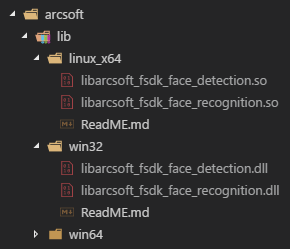

# Python调用虹软人脸认知引擎库示例

forked from [asdfqwrasdf/ArcSoft_FreeSDK_Demo/FR/python/](https://github.com/asdfqwrasdf/ArcSoft_FreeSDK_Demo/tree/master/FR/python)

基于上面代码进行修改。

## 已测试过的环境

- CentOS 7.2 x64 + Python 3.5 
- Windows 10 x64 + Python 3.5（32bit）
- Windows 10 x64 + Python 3.5（64bit）

注意事项：在Windows环境下，如果使用32位的DLL，Python也必须也要32位。

## 第一步：安装依赖包

首先需要安装依赖包（也就一个Pillow）

```sh
pip install -r requirements.txt
# OR
pip install Pillow
```

## 第二步：导入库文件

然后将虹软SDK中的DLL拷贝到`arcsoft\lib\`相关目录下，确保相关系统有detection和recognition两个库文件：



## 第三步：填写信息

填写`APPID`、`FD_SDKKEY`和`FR_SDKKEY`。

```Python
APPID = c_char_p(b'APPID')
FD_SDKKEY = c_char_p(b'FD_SDKKEY')
FR_SDKKEY = c_char_p(b'FR_SDKKEY')
```

## 第三步：完成，运行测试

执行`python3 AFRTest.py`，成功的话会输出下面信息：

```PowerShell
> python3 AFRTest.py
#####################################################
AFD Version: 1 1 0 81
Version: ArcSoft_FreeSDK_FaceDetection_1.1.0.81
BuildDate: Jan 22 2018
CopyRight: Copyright 2017 ArcSoft, Inc. All rights reserved.


AFR Version: 1 1 0 81
Version: ArcSoft_FreeSDK_FaceRecognition_1.1.0.81
BuildDate: Jan 22 2018
CopyRight: Copyright 2017 ArcSoft, Inc. All rights reserved.

similarity between faceA and faceB is c_float(1.0)


save face feature in feature.dat
feature length: 22020 Byte
#####################################################
```

同时在当前目录下会生成`feature.dat`文件，里面保存了人脸特征值，大小为22020 Byte。


## 修改输入图片

可以在`AFRTest.py`290行修改要输入的图片：

BMP文件格式：

```Python
# AFRTest.py 290行
filePathA = u'lena.bmp'
filePathB = u'lena.bmp'

inputImgA = loadImage(filePathA)
inputImgB = loadImage(filePathB)
```

yuv格式：

```Python
filePathA = u'lena_I420_fromBMP.yuv'
yuv_widthA = 512
yuv_heightA = 512
yuv_formatA = ASVL_COLOR_FORMAT.ASVL_PAF_I420

filePathB = u'lena_I420_fromBMP.yuv'
yuv_widthB = 512
yuv_heightB = 512
yuv_formatB = ASVL_COLOR_FORMAT.ASVL_PAF_I420

inputImgA = loadYUVImage(filePathA, yuv_widthA, yuv_heightA,
                            yuv_formatA)
inputImgB = loadYUVImage(filePathB, yuv_widthB, yuv_heightB,
                            yuv_formatB)
```

使用`ffmpeg -i lena.bmp -pix_fmt yuv420p lena_I420_fromBMP.yuv`命令转换

## 其他信息

虹软官方SDK下载地址：http://www.arcsoft.com.cn/ai/arcface.html

